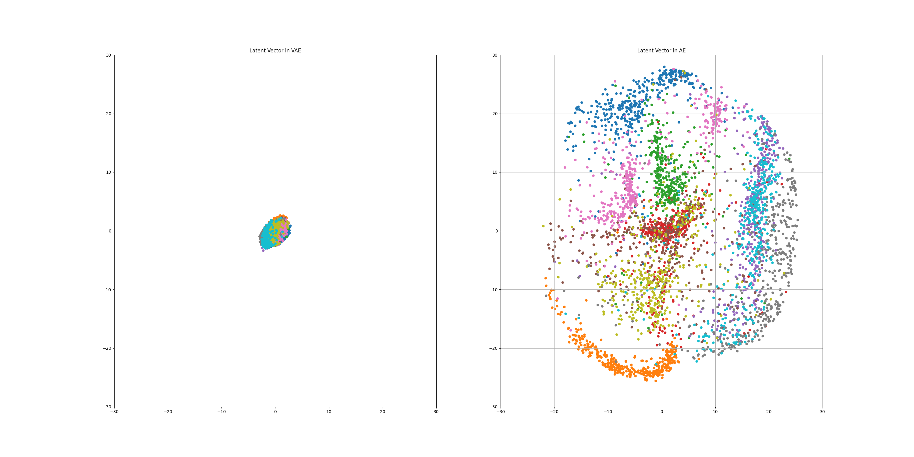
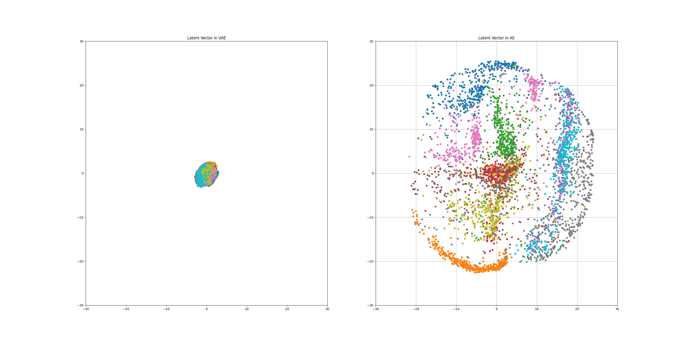
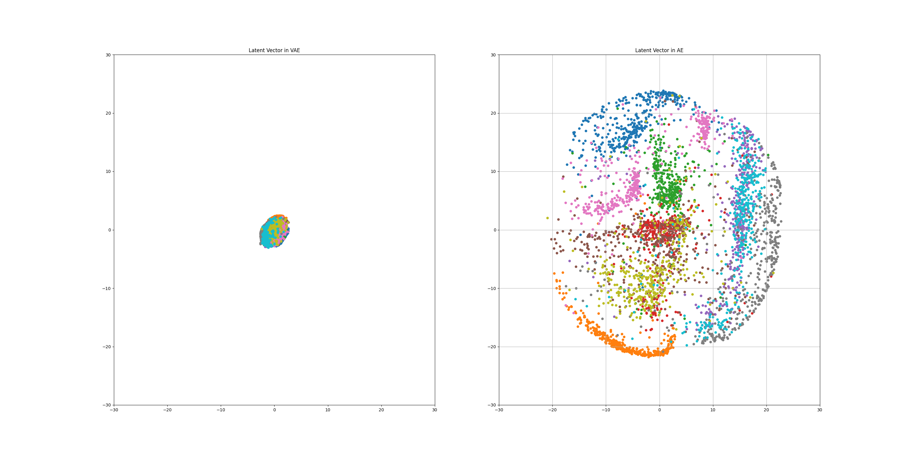
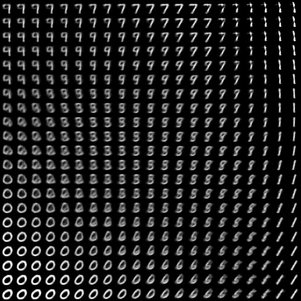

# Variatinal Auto Encoder

url : https://www.youtube.com/watch?v=rNh2CrTFpm4&t=2321s (오토인코더의 모든 것2, 이활석 박사)

## Result

* Auto Encoder와 Variational Auto Encoder의 class(0 ~ 9) 별 Latent vector 분포
 ** Epoch = 20

  

 ** Epoch = 40

  

 ** Epoch = 60

  

AE의 Latent vector z의 경우, 오토인코더의 모든 것2 에서는 z값의 class 별 분포가 계속해서 바뀌였으나, 실제로 진행해본 결과 class 별 분포는 비슷하나 스케일이 조금씩 줄어듦. 
VAE의 Latent vector z의 경우, 오토인코더의 모든 것2 에서와 동일하게 normal distribution을 따라가는 것을 확인할 수 있음. 

* Decoder(VAE)의 입력 z가 조금씩 변화함에 따라 출력되는 이미지
 ** z(x:-2.5 ~ 2.5, y:-2.5 ~ 2.5) 의 z를 입력으로 줄 때,

  

feature를 알아서 학습하여 방향에 따라 숫자의 두께나 방향이 변화됨을 확인할 수 있음.

* 결과
